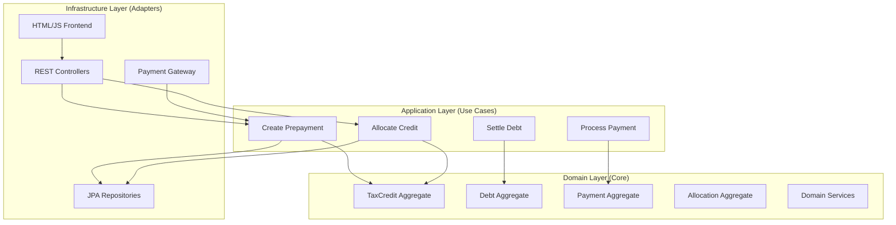

# Tax Collection and Debt Recovery System - Implementation Plan
## Part 1: Project Setup and Architecture

**Context Reference:** ctx_99a057884357  
**Technology Stack:**
- Java 17
- Spring Boot 3
- H2 Database
- Maven
- Lombok & MapStruct
- OpenAPI/Swagger
- Hexagonal Architecture

---

## 1. Project Initialization

### 1.1 Maven Project Structure
```
fodfin-agpr/
├── pom.xml
├── src/
│   ├── main/
│   │   ├── java/
│   │   │   └── com/taxauthority/debtrecovery/
│   │   │       ├── domain/              # Domain layer (core business logic)
│   │   │       │   ├── model/           # Aggregates, Entities, Value Objects
│   │   │       │   ├── repository/      # Repository interfaces (ports)
│   │   │       │   ├── service/         # Domain services
│   │   │       │   └── event/           # Domain events
│   │   │       ├── application/         # Application layer (use cases)
│   │   │       │   ├── usecase/         # Use case implementations
│   │   │       │   ├── dto/             # DTOs for application layer
│   │   │       │   └── mapper/          # MapStruct mappers
│   │   │       ├── infrastructure/      # Infrastructure layer (adapters)
│   │   │       │   ├── persistence/     # JPA entities and repositories
│   │   │       │   ├── web/             # REST controllers
│   │   │       │   ├── config/          # Spring configuration
│   │   │       │   └── gateway/         # External service adapters
│   │   │       └── TaxDebtRecoveryApplication.java
│   │   └── resources/
│   │       ├── application.yml
│   │       ├── application-dev.yml
│   │       ├── application-test.yml
│   │       ├── db/migration/            # Flyway migrations
│   │       └── static/                  # Frontend files
│   │           ├── index.html
│   │           ├── css/
│   │           ├── js/
│   │           └── assets/
│   └── test/
│       └── java/
│           └── com/taxauthority/debtrecovery/
│               ├── domain/              # Domain unit tests
│               ├── application/         # Application layer tests
│               └── infrastructure/      # Integration tests
```

### 1.2 Maven Dependencies (pom.xml)

```xml
<properties>
    <java.version>17</java.version>
    <spring-boot.version>3.2.0</spring-boot.version>
    <lombok.version>1.18.30</lombok.version>
    <mapstruct.version>1.5.5.Final</mapstruct.version>
    <springdoc.version>2.3.0</springdoc.version>
</properties>

<dependencies>
    <!-- Spring Boot Starters -->
    <dependency>
        <groupId>org.springframework.boot</groupId>
        <artifactId>spring-boot-starter-web</artifactId>
    </dependency>
    <dependency>
        <groupId>org.springframework.boot</groupId>
        <artifactId>spring-boot-starter-data-jpa</artifactId>
    </dependency>
    <dependency>
        <groupId>org.springframework.boot</groupId>
        <artifactId>spring-boot-starter-validation</artifactId>
    </dependency>
    
    <!-- H2 Database -->
    <dependency>
        <groupId>com.h2database</groupId>
        <artifactId>h2</artifactId>
        <scope>runtime</scope>
    </dependency>
    
    <!-- Lombok -->
    <dependency>
        <groupId>org.projectlombok</groupId>
        <artifactId>lombok</artifactId>
        <optional>true</optional>
    </dependency>
    
    <!-- MapStruct -->
    <dependency>
        <groupId>org.mapstruct</groupId>
        <artifactId>mapstruct</artifactId>
        <version>${mapstruct.version}</version>
    </dependency>
    
    <!-- OpenAPI/Swagger -->
    <dependency>
        <groupId>org.springdoc</groupId>
        <artifactId>springdoc-openapi-starter-webmvc-ui</artifactId>
        <version>${springdoc.version}</version>
    </dependency>
    
    <!-- Testing -->
    <dependency>
        <groupId>org.springframework.boot</groupId>
        <artifactId>spring-boot-starter-test</artifactId>
        <scope>test</scope>
    </dependency>
</dependencies>

<build>
    <plugins>
        <plugin>
            <groupId>org.apache.maven.plugins</groupId>
            <artifactId>maven-compiler-plugin</artifactId>
            <configuration>
                <annotationProcessorPaths>
                    <path>
                        <groupId>org.projectlombok</groupId>
                        <artifactId>lombok</artifactId>
                        <version>${lombok.version}</version>
                    </path>
                    <path>
                        <groupId>org.mapstruct</groupId>
                        <artifactId>mapstruct-processor</artifactId>
                        <version>${mapstruct.version}</version>
                    </path>
                </annotationProcessorPaths>
            </configuration>
        </plugin>
    </plugins>
</build>
```

---

## 2. Hexagonal Architecture Design

### 2.1 Architecture Layers



### 2.2 Port and Adapter Pattern

**Ports (Interfaces in Domain):**
- `CitizenRepository` - Port for citizen persistence
- `PrepaymentRepository` - Port for prepayment persistence
- `TaxCreditRepository` - Port for tax credit persistence
- `DebtRepository` - Port for debt persistence
- `AllocationRepository` - Port for allocation persistence
- `PaymentGateway` - Port for external payment processing
- `EventPublisher` - Port for domain event publishing

**Adapters (Implementations in Infrastructure):**
- `JpaCitizenRepository` - JPA implementation
- `JpaPrepaymentRepository` - JPA implementation
- `JpaTaxCreditRepository` - JPA implementation
- `JpaDebtRepository` - JPA implementation
- `JpaAllocationRepository` - JPA implementation
- `StripePaymentGateway` - Payment gateway adapter
- `SpringEventPublisher` - Event publishing adapter

---

## 3. Domain Model Implementation

### 3.1 Core Aggregates

Based on the domain ontology, implement these aggregates:

1. **Citizen** (Entity)
   - Identity: `citizenId` (UUID)
   - Attributes: citizenCode, firstName, lastName, nationalId, email, phone, address
   - Invariants: Unique citizenCode, unique nationalId, valid email format

2. **Prepayment** (Aggregate Root)
   - Identity: `prepaymentId` (UUID)
   - States: PENDING_PAYMENT → COMPLETED/FAILED/CANCELLED
   - Operations: create(), confirm(), fail(), cancel()
   - Events: PrepaymentConfirmed, TaxCreditCreated

3. **TaxCredit** (Aggregate Root)
   - Identity: `taxCreditId` (UUID)
   - Attributes: totalCredit, allocatedCredit, availableCredit (computed)
   - Operations: addCredit(), allocateCredit(), releaseCredit()
   - Events: CreditAdded, CreditAllocated, CreditReleased
   - Invariants: One per citizen, availableCredit = totalCredit - allocatedCredit

4. **Payment** (Aggregate Root)
   - Identity: `paymentId` (UUID)
   - States: RECEIVED → ALLOCATED/PARTIALLY_ALLOCATED/UNALLOCATED
   - Operations: receive(), allocate(), identify()
   - Events: PaymentReceived, PaymentAllocated

5. **Debt** (Aggregate Root)
   - Identity: `debtId` (UUID)
   - States: OPEN → PARTIALLY_PAID → PAID/CANCELLED
   - Operations: create(), reduce(), settle(), cancel()
   - Events: DebtCreated, DebtReduced, DebtSettled
   - Invariants: outstandingAmount <= originalAmount

6. **Allocation** (Aggregate Root)
   - Identity: `allocationId` (UUID)
   - States: PENDING → APPLIED/REVERSED
   - Types: CREDIT_TO_DEBT, PAYMENT_TO_DEBT
   - Operations: create(), apply(), reverse()
   - Events: AllocationCreated, AllocationApplied, AllocationReversed

### 3.2 Value Objects

- `Money` (amount + currency)
- `StructuredReference` (12 alphanumeric characters)
- `CitizenCode` (unique identifier)
- `DebtCode` (format: YYYY-NNNNNN)
- `PrepaymentType` (VAT, ADVANCE_PAYMENT)
- `DebtType` (TAX, PENALTY, INTEREST, OTHER)

### 3.3 Domain Services

- `AllocationService` - Handles allocation logic and rules
- `AccountingService` - Generates double-entry accounting entries
- `StructuredReferenceService` - Validates and matches structured references

---

## 4. Application Configuration

### 4.1 application.yml

```yaml
spring:
  application:
    name: tax-debt-recovery-system
  
  datasource:
    url: jdbc:h2:mem:taxdebtdb
    driver-class-name: org.h2.Driver
    username: sa
    password: 
  
  h2:
    console:
      enabled: true
      path: /h2-console
  
  jpa:
    hibernate:
      ddl-auto: validate
    show-sql: true
    properties:
      hibernate:
        format_sql: true
        dialect: org.hibernate.dialect.H2Dialect
  
  flyway:
    enabled: true
    locations: classpath:db/migration
    baseline-on-migrate: true

springdoc:
  api-docs:
    path: /api-docs
  swagger-ui:
    path: /swagger-ui.html
    enabled: true

server:
  port: 8080
  error:
    include-message: always
    include-binding-errors: always

logging:
  level:
    com.taxauthority.debtrecovery: DEBUG
    org.springframework.web: INFO
    org.hibernate.SQL: DEBUG
```

---

## 5. Database Schema Design

### 5.1 Core Tables

Based on the technical specification (section 4), create these tables:

1. **citizens**
   - citizen_id (UUID, PK)
   - citizen_code (VARCHAR, UNIQUE)
   - first_name, last_name, national_id (UNIQUE), email, phone, address
   - created_at, updated_at

2. **prepayments**
   - prepayment_id (UUID, PK)
   - citizen_id (UUID, FK)
   - prepayment_code (VARCHAR, UNIQUE)
   - prepayment_type (ENUM: VAT, ADVANCE_PAYMENT)
   - amount (DECIMAL), currency (VARCHAR)
   - status (ENUM: PENDING_PAYMENT, COMPLETED, FAILED, CANCELLED)
   - idempotency_key (VARCHAR, UNIQUE)
   - payment_gateway_reference (VARCHAR)
   - created_at, confirmed_at

3. **tax_credits**
   - tax_credit_id (UUID, PK)
   - citizen_id (UUID, FK, UNIQUE)
   - total_credit (DECIMAL)
   - allocated_credit (DECIMAL)
   - available_credit (DECIMAL, COMPUTED)
   - currency (VARCHAR)
   - version (INTEGER, for optimistic locking)
   - created_at, updated_at

4. **tax_credit_events**
   - event_id (UUID, PK)
   - tax_credit_id (UUID, FK)
   - event_type (ENUM: CREDIT_ADDED, CREDIT_ALLOCATED, CREDIT_RELEASED)
   - amount (DECIMAL)
   - source_type (ENUM: PREPAYMENT, REFUND, ADJUSTMENT)
   - source_id (UUID)
   - metadata (JSON)
   - created_at

5. **payments**
   - payment_id (UUID, PK)
   - citizen_id (UUID, FK)
   - payment_code (VARCHAR, UNIQUE)
   - amount (DECIMAL), currency (VARCHAR)
   - structured_reference (VARCHAR, UNIQUE)
   - target_debt_id (UUID, FK, nullable)
   - status (ENUM: RECEIVED, ALLOCATED, PARTIALLY_ALLOCATED, UNALLOCATED)
   - received_at, allocated_at, created_at

6. **debts**
   - debt_id (UUID, PK)
   - citizen_id (UUID, FK)
   - debt_code (VARCHAR, UNIQUE)
   - debt_type (ENUM: TAX, PENALTY, INTEREST, OTHER)
   - original_amount (DECIMAL)
   - outstanding_amount (DECIMAL)
   - currency (VARCHAR)
   - due_date (DATE)
   - status (ENUM: OPEN, PARTIALLY_PAID, PAID, CANCELLED)
   - priority (INTEGER)
   - structured_reference (VARCHAR, UNIQUE)
   - version (INTEGER)
   - created_at, updated_at, settled_at

7. **allocations**
   - allocation_id (UUID, PK)
   - allocation_code (VARCHAR, UNIQUE)
   - allocation_type (ENUM: CREDIT_TO_DEBT, PAYMENT_TO_DEBT)
   - source_id (UUID)
   - target_debt_id (UUID, FK)
   - amount (DECIMAL), currency (VARCHAR)
   - status (ENUM: PENDING, APPLIED, REVERSED)
   - applied_at, reversed_at, created_at

8. **accounting_entries**
   - entry_id (UUID, PK)
   - entry_type (ENUM: DEBIT, CREDIT)
   - account (VARCHAR)
   - amount (DECIMAL), currency (VARCHAR)
   - operation_type (ENUM: PREPAYMENT, PAYMENT, ALLOCATION, REVERSAL)
   - operation_id (UUID)
   - description (TEXT)
   - metadata (JSON)
   - created_at

---

## 6. Implementation Phases

### Phase 1: Foundation (Week 1)
- [ ] Set up Maven project structure
- [ ] Configure Spring Boot application
- [ ] Set up H2 database and Flyway migrations
- [ ] Create base domain model classes
- [ ] Implement repository interfaces (ports)
- [ ] Configure Lombok and MapStruct

### Phase 2: Core Domain (Week 2)
- [ ] Implement Citizen aggregate
- [ ] Implement Prepayment aggregate with state machine
- [ ] Implement TaxCredit aggregate with event sourcing
- [ ] Implement domain services
- [ ] Write unit tests for domain logic

### Phase 3: Infrastructure (Week 3)
- [ ] Implement JPA entities and repositories
- [ ] Create REST controllers
- [ ] Configure OpenAPI/Swagger
- [ ] Implement payment gateway adapter (mock)
- [ ] Write integration tests

### Phase 4: Additional Features (Week 4)
- [ ] Implement Payment aggregate
- [ ] Implement Debt aggregate
- [ ] Implement Allocation aggregate
- [ ] Implement automatic allocation rules
- [ ] Implement accounting service

### Phase 5: Frontend & Testing (Week 5)
- [ ] Create HTML/CSS/JavaScript frontend
- [ ] Implement citizen dashboard
- [ ] Implement prepayment form
- [ ] End-to-end testing
- [ ] Performance testing

---

## 7. Key Technical Decisions

### 7.1 Optimistic Locking
Use `@Version` annotation on TaxCredit and Debt aggregates to prevent concurrent modification issues.

### 7.2 Event Sourcing for TaxCredit
Maintain complete audit trail by storing all credit changes as immutable events in `tax_credit_events` table.

### 7.3 Idempotency
Use `idempotency_key` on Prepayment to prevent duplicate transactions.

### 7.4 State Machines
Implement state pattern for Prepayment, Payment, Debt, and Allocation aggregates.

### 7.5 Double-Entry Accounting
Every financial operation generates balanced accounting entries (debits = credits).

---

## Next Steps

After reviewing this plan:
1. Proceed to **Part 2: Domain Implementation** for detailed aggregate implementations
2. Review **Part 3: API and Frontend** for REST endpoints and UI design
3. Begin implementation starting with Phase 1